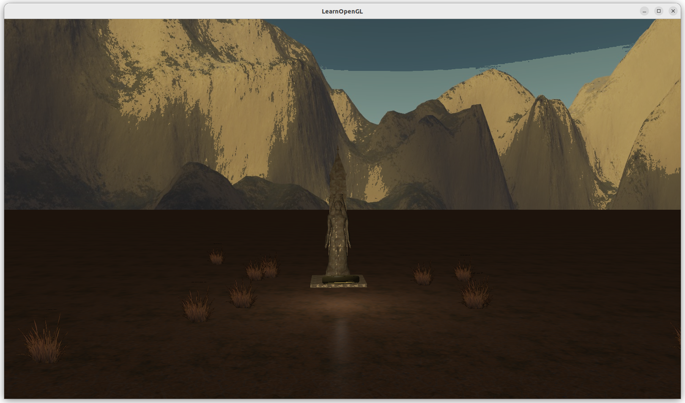

# Egypt ring

A magic rotating ring in front of an ancient statue.

# Photos

 
# Keyboard instructions:

Moving: 
`W` - forwards

`S` - backwards

`A` - left

`D` - right
   
 
Ambient manipulation:
 

`F` - turn on/off flashlight

`B` - turn on/off bloom

`Q` - lower the exposure

`E` - raise the exposure

# Implemented techniques

- Required:
   - [x] [Blending, discard]
   - [x] [Face culling]
   - [x] [Advanced lighting] 
- Group A:
   - [x] [Cubemaps - skybox]  
- Group B:
   - [x] [Bloom] [HDR]
